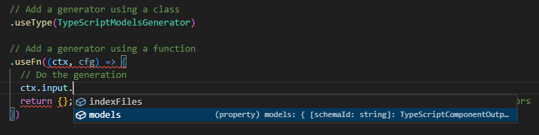

# gOAst

[](https://www.npmjs.com/package/@goast/core)
[](https://www.npmjs.com/package/@goast/typescript)
[](https://www.npmjs.com/package/@goast/kotlin)

**gOAst** stands for **g**enerative **O**pen **A**PI **s**pecification **t**ransformer, a tool designed to transform OpenAPI specifications into various forms with flexibility and extensibility at its core.

## Motivation 💥

While numerous OpenAPI generators exist, they often cater to specific languages or frameworks and lack the flexibility for customization or extension to meet unique requirements.

**gOAst** aims to bridge this gap by offering a highly flexible and extensible platform for transforming OpenAPI specifications into any desired form.
It not only includes a set of pre-built generators but also simplifies the process of creating new ones or extending existing functionalities.

## Features 🔥

✅ **Ease of Use**: Get up and running with minimal setup.

✅ **Type Safety**: Ensures robust and error-free code.

✅ **Basic AST Support**: For TypeScript and Kotlin, facilitating further custom transformations.

✅ **Module Support**: Compatible with both ESM and CJS modules.

## How It Works 🔧

**gOAst** employs a structured approach to transform OpenAPI specifications, making it easy to extend or generate new data forms:

1. **Parse OpenAPI Specification Files**

   - Supports versions 2.0, 3.0, and 3.1 in both JSON and YAML formats.
   - Allows parsing multiple files together (e.g., from different microservices).
   - Facilitates the use of mixed OpenAPI specification versions and formats.

2. **Load External References ($ref)**

   - Supports loading of local and HTTP/HTTPS references.
   - Manages references across different versions of OpenAPI specifications.

3. **Transform to a General Format**

   - Standardizes various OpenAPI versions into a unified format for subsequent transformations.

4. **Generate Output using a Pipeline Approach**
   - Defines a transformation pipeline to produce the desired output.
   - Generators can utilize information from previous steps and modify the output as needed, enhancing flexibility (e.g., a Service generator that relies on a Model generator).

## Getting Started 🚀

Install the core package and the desired generator(s) using npm:

```bash
npm install @goast/core @goast/typescript
```

Use the core package to parse and transform an OpenAPI specification:

```typescript
import { OpenApiGenerator } from '@goast/core';
import { TypeScriptModelsGenerator } from '@goast/typescript';

async function main() {
  const generator = new OpenApiGenerator()

    // Add a generator using a class
    .useType(TypeScriptModelsGenerator)

    // Add a generator using a function
    .useFn((ctx, cfg) => {
      // Do the generation
      return {}; // Return information about the generated files so it can be used by other generators
    })

    // Add a generator using an object implementing `OpenApiGenerationProvider`
    .useValue({ generate: (ctx, cfg) => ({}) });

  // Generate for one of more OpenAPI specification files
  await generator.parseAndGenerate('path/to/openapi.json', 'path/to/another/openapi.yaml');

  // Alternatively, you can generate output for all specifications in a directory.
  // By default, it will only consider files within the directory (non-recursively) with the extensions: .json, .yaml, .yml.
  await generator.parseAndGenerateFromDir('path/to/openapi/specs');
}

main();
```

Outputs from a previous generator can be accessed by the `input` property of the context object:


### Extending Generators

All generators included with gOAst are implemented by classes.
This allows for easy extension by creating a new class that extends the desired generator.
Most generators consist of two classes. One for generation of one entity (e.g. a schema or endpoint) and one for the whole specification.

In this example we are extending the model generator for typescript to modify the type names:

```typescript
import { ApiSchema, Factory, toCasing } from '@goast/core';
import {
  DefaultTypeScriptModelGenerator,
  TypeScriptModelGeneratorContext,
  TypeScriptModelsGenerator,
} from '@goast/typescript';

class MyTypeScriptModelGenerator extends DefaultTypeScriptModelGenerator {
  protected override getDeclarationTypeName(ctx: TypeScriptModelGeneratorContext, schema: ApiSchema): string {
    let name = schema.name;
    // Modify the name of the schema
    return toCasing(name, ctx.config.typeNameCasing);
  }
}

export class MyTypeScriptModelsGenerator extends TypeScriptModelsGenerator {
  constructor() {
    super(Factory.fromType(MyTypeScriptModelGenerator));
  }
}
```

This custom class can now be used in the same way as the original model generator:

```typescript
// ...
generator.useType(MyTypeScriptModelsGenerator, {
  /* Options (Optional) */
});
// ...
```

## Available Libraries 📚

| Name              | Description                                                      | Links                                                                                              |
| ----------------- | ---------------------------------------------------------------- | -------------------------------------------------------------------------------------------------- |
| @goast/core       | Core library for parsing and transforming OpenAPI specifications | [NPM](https://www.npmjs.com/package/@goast/core) - [README](./packages/core/README.md)             |
| @goast/typescript | TypeScript generators for OpenAPI specifications                 | [NPM](https://www.npmjs.com/package/@goast/typescript) - [README](./packages/typescript/README.md) |
| @goast/kotlin     | Kotlin generators for OpenAPI specifications                     | [NPM](https://www.npmjs.com/package/@goast/kotlin) - [README](./packages/kotlin/README.md)         |

## Contributing 🧑🏻‍💻

Contributions are what make the open source community such an amazing place to learn, inspire, and create. Any contributions you make are **greatly appreciated**.

If you have a suggestion that would make this better, please fork the repo and create a pull request. You can also simply open an issue with the tag "enhancement".
Don't forget to give the project a star! Thanks again!

1. Fork the Project
2. Create your Feature Branch (`git checkout -b feature/AmazingFeature`)
3. Commit your Changes (`git commit -m 'Add some AmazingFeature'`)
4. Push to the Branch (`git push origin feature/AmazingFeature`)
5. Open a Pull Request

## License 🔑

Distributed under the MIT License. See [`LICENSE`](LICENSE) for more information.
